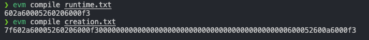

### Goals

Creare very small contract that will respond to `whatIsTheMeaningOfLife()` with 42. The contract should have at most 10 OP_CODES.

### Exploit

Helpful materials:

- https://ardislu.dev/raw-bytecode-evm
- https://gist.github.com/hayesgm/a8c709de188a9ab0928960268f23d518

We need to return 42 so we need to write opcodes that will return that and also wrap it up in creation bytecode.

### RUNTIME:

```evm
// runtime.txt

PUSH 0x2a // push 42
PUSH 0x00 // push 0x0 the location slot
MSTORE  // saves to memory 42 at slot 0

PUSH 0x20 // push 32 bytes
PUSH 0x00 // push slot 0
RETURN // returns the offset (slot0) and the size (32 bytes)
;;
```

### CREATION

```evm
// creation.txt

[00] PUSH10 0x602a60005260206000f3 // push runtime code
[0b] PUSH1 00 // push slot 0 as location
[0d] MSTORE // save
[0e] PUSH1 0a // push 10 bytes
[10] PUSH1 16 // push 0x16 -> 22 // we have pushed to slot which has length of 32 bytes, the data we pushed has legnth of 10 bytes so -> 32 - 10 = 22 which comes to 0x16 in hex, thats where our data starts.
[12] RETURN

```

### Geth

We can use [geth](https://github.com/ethereum/go-ethereum) to translate mnemonics into opcodes.



### Code

Now we will need to deploy the contract. We can use simple tx for that.

In console on ethernaut:

```code
await sendTransaction({from: player, data: "0x69602a60005260206000f3600052600a6000f3"}) //data is bytecode returned from compiling creation
```

or optionally we can deploy with smart contract:

```code
function deployBytecode(bytes memory bytecode) public returns (address) {
    address retval;
    assembly{
        mstore(0x0, bytecode)
        retval := create(0,0xa0, calldatasize())
    }
    return retval;
}
```

we might need to adjust gas limit for the transaction, around 70k should be fine.

The command should return tx hash. We can grab it and with help of explorer find the address of newly deployed contract.

We grab it and call:

```code
await contract.setSolver(0xYOUR_CONTRACT)
```

Done!
